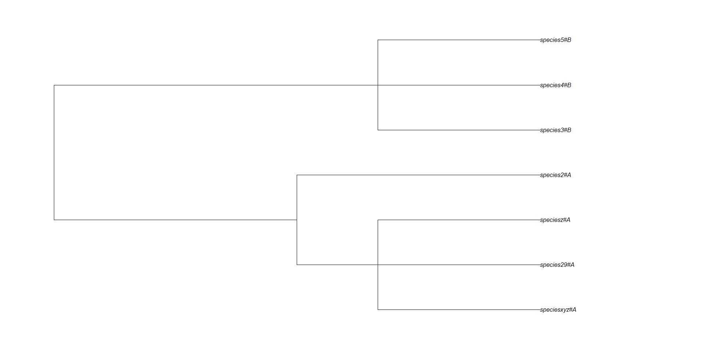
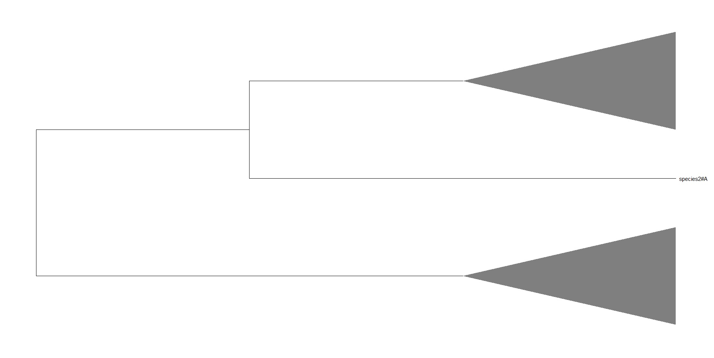
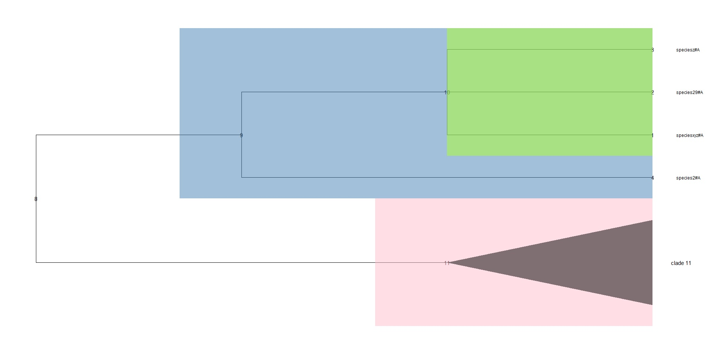
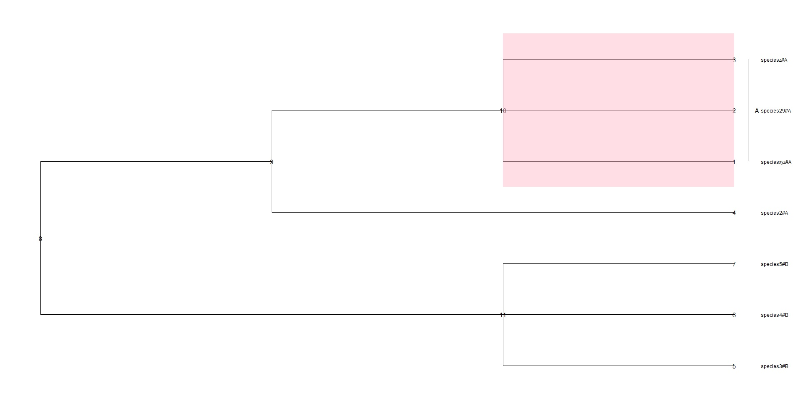

# phylogenetic-tree-collapse-and-color
Here are some ways to collapse, color and name phylogenetic clades in R language.
This repository also contains example tree so feel free to try out the scripts with it.
# Phylogenetic Tree Analysis with ggtree and ape

This repository contains scripts for analyzing and visualizing phylogenetic trees using `ggtree` (3.8.0) and `ape` (ape_5.7-1) packages in R 4.3.0. The scripts demonstrate techniques such as collapsing nodes, coloring clades, and automatically naming clades based on species names in specific format.

## The example tree in Newick format
- File: [example_tree](example_tree)

## Code Descriptions

### Collapsing Many Nodes at Once
- File: [collapsing_many_clades_at_once.r](collapsing_many_clades_at_once.r)
- Description: This script showcases how to collapse multiple nodes at once in a phylogenetic tree using the `ggtree` package. It provides a function to collapse clades to triangles and visualizes the results with customizable colors and labels.



### Collapsing, Coloring, and Naming Clades
- File: [collapsing_coloring_naming_clades.r](collapsing_coloring_naming_clades.r)
- Description: This script demonstrates how to collapse, color, and name multiple clades in a phylogenetic tree using the `ggtree` package. It performs collapsing, coloring, and naming operations on selected clades.



### Automatic Clade Naming
- File: [naming_clades_without_node_numbers.r](naming_clades_without_node_numbers.r)
- Description: This script demonstrates how to automatically name a clade based on species names in specific format using the `ape` and `ggtree` packages. It provides functions to extract letters after '#' in species names, finds nodes for specified species, and generates a tree plot with labeled clades.



## Installation

To use the scripts in this repository, you'll need to have R and the required packages installed. Here's how you can set up your environment:

1. **Install R:**
   If you don't have R installed, download and install it from the [R Project website](https://www.r-project.org/).

2. **Install Required Packages:**
   Open an R interpreter or RStudio and install the necessary packages by running the following commands:

   ```R
   install.packages("ggtree")
   install.packages("ape")


## Usage
1. Clone or download this repository.
2. Install the required R packages (`ape` and `ggtree`) if you haven't already.
3. Run the scripts using an R interpreter or RStudio.
4. Follow the comments and modify parameters as needed for your specific use case.

## License
This project is licensed under the [MIT License](LICENSE).

Feel free to explore, modify, and use these scripts for your phylogenetic tree analysis needs. If you find these scripts helpful, consider giving credit by linking to this repository.

For any questions or issues, please open an [issue](https://github.com/natala2/phylogenetic-tree-collapse-and-color/issues) on this repository.

I would like to acknowledge the helpfulness of various resources, including AI-powered assistance.
